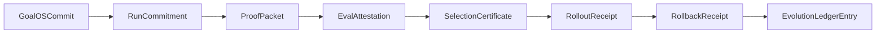

# Architecture

```mermaid
flowchart LR
  Objective --> MissionContract[Mission Contract]
  MissionContract --> AutonomousWork[Autonomous Work]
  AutonomousWork --> Verification
  Verification --> EvidenceDocket[Evidence Docket]
  EvidenceDocket --> GDS[Governed Decision State]
  GDS --> ActionGraph[Action Graph]
  ActionGraph --> Chronicle
  Chronicle --> Capability[Reusable Capability]
```

GoalOS organizes work into Mission Contracts, proof packets, Evidence Dockets, validator reports, Governed Decision States, Action Graphs, Chronicle entries, and reusable capabilities.

> Boundary: public-alpha only. No user data. No user funds. No wallet. No transaction. No production authority. Human review required. $AGIALPHA public contract identification only; $AGIALPHA is not available from us. No investment, trading, tax, legal, wallet, exchange, bridge, liquidity, or regulatory advice.
