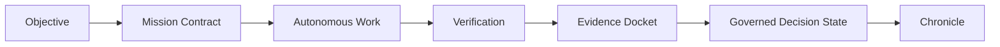

# Architecture

GoalOS is designed around proof-carrying work: objective, bounded permission scope, reason, action, evidence, validator, risk, rollback, and reusable capability.

## Public-alpha boundary

No user data. No user funds. No wallet. No transaction. No production authority. Human review required. Browser-local demos remain browser-local unless a page explicitly says otherwise. Do not submit personal, customer, confidential, regulated, credential, wallet, payment, private-key, seed-phrase, privileged, trade-secret, or proprietary data. $AGIALPHA public contract identification only; $AGIALPHA is not available from us. No sale, custody, wallet support, bridge support, exchange support, market making, liquidity support, recommendation, trading advice, financial advice, tax advice, legal advice, or regulatory advice. Third parties are solely responsible for their own review and compliance.

