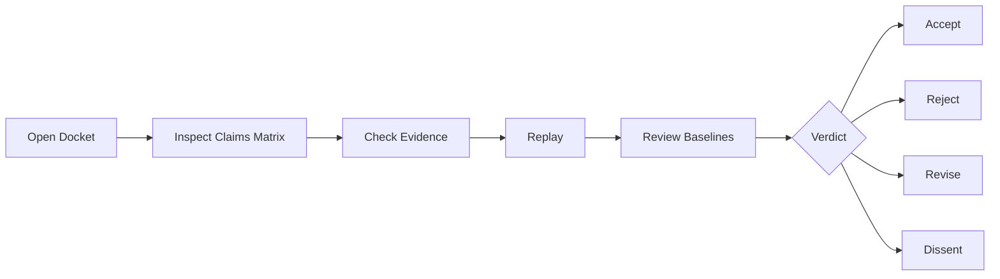

# Replay

Replay is the reviewer path for checking whether a docket can be inspected again.

Run local checks, compare generated reports, cite commands, and record differences. Do not request secrets, wallets, private data, or live transactions.
> Boundary: public-alpha only. No user data. No user funds. No wallet. No transaction. No production authority. Human review required. $AGIALPHA public contract identification only; $AGIALPHA is not available from us. No investment, trading, tax, legal, wallet, exchange, bridge, liquidity, or regulatory advice.
