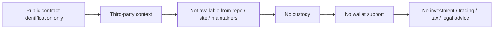

# Token boundary

$AGIALPHA public contract address is public-contract identification only. $AGIALPHA is not available from us. We do not sell, distribute, custody, broker, recommend, market, list, support, provide liquidity for, or make available $AGIALPHA. We do not provide investment, trading, tax, legal, exchange, bridge, liquidity, wallet, or regulatory advice. Third parties are responsible for their own review and compliance.
> Boundary: public-alpha only. No user data. No user funds. No wallet. No transaction. No production authority. Human review required. $AGIALPHA public contract identification only; $AGIALPHA is not available from us. No investment, trading, tax, legal, wallet, exchange, bridge, liquidity, or regulatory advice.
