# Architecture Primer

---
**Project:** GoalOS AGIALPHA Ascension - Sovereign Machine Economy  
**Series:** Institutional Document Series  
**Status:** Public institutional scaffold; not production authorization.  
**Use:** GitHub-ready Markdown, public-site source, board/partner briefing source, and operator onboarding source.  

> **Plain-language promise:** GoalOS is presented as a proof-first operating surface for autonomous AI work. It is designed to help people see what was requested, what work was performed, what evidence was captured, what risks were controlled, what was validated, and what can be reused.

> **Claim boundary:** This document is claim-bounded. It does not assert unsupported AGI achievement, ASI, autonomous legal sovereignty, mainnet production readiness, security audit completion, financial return, legal approval, tax approval, user-fund authorization, or guaranteed adoption. Strong claims require Evidence Dockets, validator reports, replay logs, cost and risk ledgers, and human authorization where appropriate.
---

## Audience

Executives, operators, technical reviewers, designers, and contributors who need the system model without reading source code.

## Purpose

Explain the architecture in a simple but serious way.

## Architecture in one sentence

GoalOS turns an objective into a governed proof loop, then turns accepted proof into reusable capability.

## System flow

```mermaid
flowchart LR
  A[Objective] --> B[Mission Contract]
  B --> C[Proof Jobs]
  C --> D[Tool Traces]
  D --> E[ProofBundle]
  E --> F[Evidence Docket]
  F --> G[Validator Reports]
  G --> H[Governed Decision State]
  H --> I[Settlement Receipt]
  I --> J[Chronicle]
  J --> K[Capability Package]
```

## Plain-language explanation

| Component | Plain-language meaning |
|---|---|
| Objective | The thing the operator wants done. |
| Mission Contract | The bounded instruction: scope, success criteria, limits, and evidence required. |
| Proof Job | A unit of work assigned to an agent or workflow. |
| Tool Trace | A record of what tools were used and what they returned. |
| ProofBundle | A collected evidence package for a job or claim. |
| Evidence Docket | The main review file that says what claim is being made and what supports it. |
| Validator Report | A structured review by a validator, reviewer, or automated check. |
| Governed Decision State | The result: accepted, rejected, revise, hold, or escalate. |
| Settlement Receipt | A record that work reached an accepted settlement state. |
| Chronicle | Durable institutional memory of what was learned and accepted. |
| Capability Package | A reusable unit of accepted work. |

## Architecture principles

### 1. Bounded work

Every mission needs scope. A mission without boundaries becomes impossible to validate.

### 2. Evidence before confidence

Confidence should follow evidence, not presentation quality. The system should make it easy to see what supports a conclusion.

### 3. Validation before reuse

A capability should not be reused just because it was generated. It should be reused because it passed review.

### 4. Human authority where needed

GoalOS can structure autonomous work, but release authority and sensitive actions remain governed.

### 5. Public proof, private data

The public repository should prove process and structure without exposing secrets, private data, credentials, or confidential material.

## Layered architecture

| Layer | Responsibility |
|---|---|
| Interface layer | Website, docs, operator guides, public trust pages. |
| Mission layer | Mission contracts, jobs, claims matrix, success criteria. |
| Execution layer | Agents, tools, traces, runtime events. |
| Evidence layer | ProofBundles, sources, replay logs, cost/risk ledgers. |
| Validation layer | Validators, reports, acceptance criteria, decision states. |
| Memory layer | Chronicle, capability registry, institutional learning. |
| Governance layer | claim boundaries, release gates, risk controls, pause/rollback. |

## Why this architecture matters

Most agent systems focus on doing work. GoalOS focuses on making work institutionally acceptable.

Institutional acceptability requires evidence, review, and control. The architecture is designed to keep those requirements visible instead of treating them as an afterthought.

## Document control

| Field | Value |
|---|---|
| Owner | MontrealAI / GoalOS maintainers |
| Review cadence | Review before every public release or major repository regeneration |
| Evidence expectation | Update only with traceable sources, reproducible artifacts, or explicitly marked strategy assumptions |
| Publication rule | Keep the claim boundary visible in every public-facing derivative |
