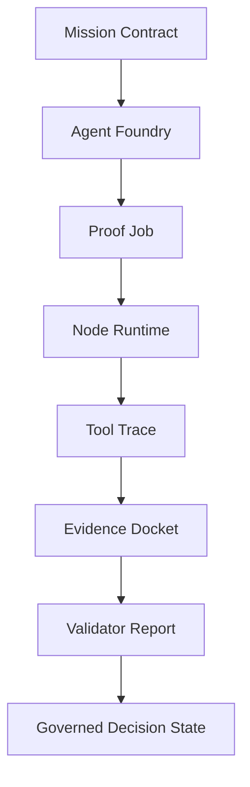

# Agent, Job, and Node Integration

---
**Project:** GoalOS AGIALPHA Ascension - Sovereign Machine Economy  
**Series:** Institutional Document Series  
**Status:** Public institutional scaffold; not production authorization.  
**Use:** GitHub-ready Markdown, public-site source, board/partner briefing source, and operator onboarding source.  

> **Plain-language promise:** GoalOS is presented as a proof-first operating surface for autonomous AI work. It is designed to help people see what was requested, what work was performed, what evidence was captured, what risks were controlled, what was validated, and what can be reused.

> **Claim boundary:** This document is claim-bounded. It does not assert unsupported AGI achievement, ASI, autonomous legal sovereignty, mainnet production readiness, security audit completion, financial return, legal approval, tax approval, user-fund authorization, or guaranteed adoption. Strong claims require Evidence Dockets, validator reports, replay logs, cost and risk ledgers, and human authorization where appropriate.
---

## Audience

Project maintainers, contributors, reviewers, and readers familiar with the earlier AGI Alpha Agent, AGI Jobs, and AGI Alpha Node repositories.

## Purpose

Show how the previous project lineage is reimplemented inside GoalOS AGIALPHA Ascension without overstating current capability.

## Integration thesis

The new repository does not discard the earlier work. It reorganizes it into a proof-first institutional architecture.

The three prior layers become:

| Previous layer | GoalOS reimplementation | Practical role |
|---|---|---|
| META-AGENTIC alpha-AGI / AGI Alpha Agent | Meta-Agentic Council and Agent Foundry | Agents that create, select, evaluate, or reconfigure other agents. |
| AGI Jobs v0 | AGI Jobs Ledger | Bounded jobs, status gates, audit artifacts, and CI-style checks. |
| AGI Alpha Node v0 | Node Runtime | Operator authority, runtime controls, validator routing, pause/resume, observability. |

## Meta-Agentic Council

A normal agent performs a task. A meta-agentic layer governs the creation and selection of task-performing agents.

In GoalOS, the Meta-Agentic Council should be responsible for:

- defining agent roles
- selecting agents for Proof Jobs
- evaluating outputs
- routing weak outputs back for revision
- proposing capability package updates
- documenting agent limitations

The council is not a claim of unsupported AGI achievement. It is an architectural pattern for governed agent orchestration.

## AGI Jobs Ledger

The Jobs layer turns work into reviewable packets.

A good Proof Job has:

- job ID
- mission ID
- owner or agent role
- input scope
- expected output
- required evidence
- status
- risks
- validation path

This gives the project a practical command surface instead of an informal conversation log.

## Node Runtime

The Node Runtime represents operator control and runtime governance.

It should include concepts such as:

- identity route
- validator roster
- pause/resume state
- release gate status
- runtime warnings
- operator override
- rollback state
- observability records

The key principle is that autonomy remains governed.

## Integrated flow

## Practical rule

The agent layer can propose. The job layer records. The node layer controls. The evidence layer proves. The validator layer decides.

That separation is what makes the architecture institutionally credible.

## Document control

| Field | Value |
|---|---|
| Owner | MontrealAI / GoalOS maintainers |
| Review cadence | Review before every public release or major repository regeneration |
| Evidence expectation | Update only with traceable sources, reproducible artifacts, or explicitly marked strategy assumptions |
| Publication rule | Keep the claim boundary visible in every public-facing derivative |
