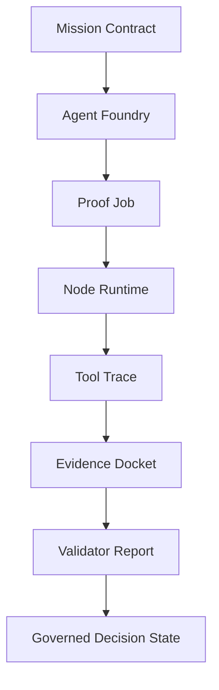

# GoalOS AGIALPHA Ascension - Sovereign Machine Economy

## Institutional Document Series Compendium

This compendium combines the public institutional document series into one master Markdown file.


---

## Document Series Index

---
**Project:** GoalOS AGIALPHA Ascension - Sovereign Machine Economy  
**Series:** Institutional Document Series  
**Status:** Public institutional scaffold; not production authorization.  
**Use:** GitHub-ready Markdown, public-site source, board/partner briefing source, and operator onboarding source.  

> **Plain-language promise:** GoalOS is presented as a proof-first operating surface for autonomous AI work. It is designed to help people see what was requested, what work was performed, what evidence was captured, what risks were controlled, what was validated, and what can be reused.

> **Claim boundary:** This document is claim-bounded. It does not assert unsupported AGI achievement, ASI, autonomous legal sovereignty, mainnet production readiness, security audit completion, financial return, legal approval, tax approval, user-fund authorization, or guaranteed adoption. Strong claims require Evidence Dockets, validator reports, replay logs, cost and risk ledgers, and human authorization where appropriate.
---

## Audience

Executives, maintainers, non-technical operators, reviewers, contributors, and public readers.

## Purpose

Provide one clean map of the entire institutional documentation set and explain how to use it without needing to understand code.


## The role of the series

This document series turns the repository into an institutional surface: easy to understand, easy to review, easy to operate, and hard to overclaim. It gives the project a consistent public voice while preserving a rigorous proof boundary.

The series is not only marketing copy. It is the connective tissue between repository artifacts, website pages, proof objects, governance controls, and operational workflows.

## The complete series

| # | Document | What it does |
|---:|---|---|
| 01 | Executive Brief | Defines the thesis, value, capability stack, and claim boundary in plain language. |
| 02 | Vision and Category Narrative | Gives the public story: proof-settled autonomous AI work. |
| 03 | Product and Capability Overview | Explains the product surfaces and what each layer enables. |
| 04 | Non-Technical Operator Guide | Shows how a non-technical user can understand and operate the repo. |
| 05 | Architecture Primer | Explains the system map without assuming engineering expertise. |
| 06 | Proof Operating Model | Describes the Mission Contract to Evidence Docket to Settlement flow. |
| 07 | Evidence Docket and Validation Standard | Defines what counts as acceptable evidence. |
| 08 | Agent, Job, and Node Integration | Connects the previous AGI Alpha Agent, AGI Jobs, and AGI Alpha Node concepts. |
| 09 | Trust, Governance, and Assurance | Describes human authority, validator gates, risk controls, and auditability. |
| 10 | Security, Privacy, and Claim Boundary | Keeps the public surface credible and safe to publish. |
| 11 | Enterprise Operating Model | Shows how teams, roles, and operating rhythms can use GoalOS. |
| 12 | Developer and Repository Guide | Maps the files, schemas, scripts, actions, and checks. |
| 13 | GitHub Web UI Launch Guide | Gives click-by-click publishing instructions. |
| 14 | Pilot Program and Evaluation Plan | Turns the project into a measurable 30/60/90 day pilot. |
| 15 | Public Website and Communications Kit | Provides public copy, launch copy, and website section guidance. |
| 16 | Procurement, Data Room, and Board Pack | Prepares the project for institutional review. |
| 17 | Roadmap, Operating Metrics, and OKRs | Defines practical progression and measurable outcomes. |
| 18 | FAQ and Glossary | Answers common questions in plain language. |
| 19 | Publication Checklist | Final review checklist before public release. |
| 20 | One-Page Board Brief | A concise board-level summary. |

## Best-practice structure

Each document uses a consistent pattern:

1. **Audience** - who should read it.
2. **Purpose** - why it exists.
3. **Plain-language explanation** - what it means without jargon.
4. **Operating model** - what to do with it.
5. **Claim boundary** - what it does not claim.
6. **Document control** - ownership, review cadence, and publication rule.

## How to use the series on GitHub

1. Add the folder to `docs/series/`.
2. Link this index from the repository `README.md`.
3. Link the non-technical guide from `START_HERE.md`.
4. Link the website copy kit from the generated site manifest.
5. Use the publication checklist before every release.
6. When a claim becomes stronger, update the Evidence Docket before updating public copy.

## The standard for future edits

A good edit makes the project easier to trust. A weak edit makes the project sound larger than the evidence can carry. When in doubt, keep ambition high and claims narrow.


## Document control

| Field | Value |
|---|---|
| Owner | MontrealAI / GoalOS maintainers |
| Review cadence | Review before every public release or major repository regeneration |
| Evidence expectation | Update only with traceable sources, reproducible artifacts, or explicitly marked strategy assumptions |
| Publication rule | Keep the claim boundary visible in every public-facing derivative |


---

## Executive Brief

---
**Project:** GoalOS AGIALPHA Ascension - Sovereign Machine Economy  
**Series:** Institutional Document Series  
**Status:** Public institutional scaffold; not production authorization.  
**Use:** GitHub-ready Markdown, public-site source, board/partner briefing source, and operator onboarding source.  

> **Plain-language promise:** GoalOS is presented as a proof-first operating surface for autonomous AI work. It is designed to help people see what was requested, what work was performed, what evidence was captured, what risks were controlled, what was validated, and what can be reused.

> **Claim boundary:** This document is claim-bounded. It does not assert unsupported AGI achievement, ASI, autonomous legal sovereignty, mainnet production readiness, security audit completion, financial return, legal approval, tax approval, user-fund authorization, or guaranteed adoption. Strong claims require Evidence Dockets, validator reports, replay logs, cost and risk ledgers, and human authorization where appropriate.
---

## Audience

Founders, board members, executive sponsors, strategic partners, and public reviewers.

## Purpose

Explain what GoalOS AGIALPHA Ascension is, why it matters, what it enables, and how it avoids unsupported claims.


## Executive thesis

AI systems increasingly produce useful work, but most organizations still struggle to answer basic institutional questions:

- What exactly was requested?
- Which agent or tool performed the work?
- What evidence supports the result?
- What risks were identified and mitigated?
- Who validated the output?
- What can be reused safely?
- What should never be publicly claimed without more proof?

GoalOS AGIALPHA Ascension is designed around those questions. It is a proof-first operating surface for autonomous AI work. It does not treat output as sufficient. It treats output as the beginning of an evidence lifecycle.

## The practical opportunity

The next useful layer above models is not simply "more agents." It is a governed machine-work system that can convert model capability into verified work, verified work into reusable capability, and reusable capability into productive institutional capacity.

In practical terms, GoalOS helps an organization move from:

```text
Prompt -> Answer
```

to:

```text
Objective -> Mission Contract -> Proof Job -> Evidence Docket -> Validator Report -> Governed Decision State -> Settlement Receipt -> Capability Package
```

That transformation is the difference between impressive demos and institutionally usable work.

## What the repository represents

The repository is a public, GitHub-native operating surface for the concept. It contains:

| Layer | What it provides |
|---|---|
| Mission layer | Bounded objectives and success criteria. |
| Agent layer | Meta-agentic coordination and role separation. |
| Job layer | Work packets, status gates, and traceability. |
| Node layer | Operator authority, pause/resume controls, and runtime governance. |
| Evidence layer | ProofBundles, tool traces, source provenance, and Evidence Dockets. |
| Validation layer | Validator reports and governed decision states. |
| Reuse layer | Chronicle entries and reusable capability packages. |
| Publication layer | Generated public website with claim-boundary checks. |

## Why the claim boundary strengthens the project

Institutional buyers and serious technical reviewers do not trust inflated claims. They trust systems that know what they can prove.

GoalOS should sound ambitious, but it should not claim more than its evidence supports. The correct posture is:

```text
Large vision. Narrow claims. Strong evidence. Clear controls.
```

## Executive success criteria

A successful public release should make a reader believe four things:

1. The project has a clear category: proof-settled autonomous AI work.
2. The repository is easy enough for a non-technical operator to launch.
3. The architecture is credible enough for a technical reviewer to inspect.
4. The claim boundary is disciplined enough for institutional trust.

## Recommended executive message

> GoalOS turns autonomous AI work into evidence-bearing institutional capability. It gives agents a proof loop, operators a control plane, validators a review surface, and organizations a way to reuse accepted capability without confusing output for truth.


## Document control

| Field | Value |
|---|---|
| Owner | MontrealAI / GoalOS maintainers |
| Review cadence | Review before every public release or major repository regeneration |
| Evidence expectation | Update only with traceable sources, reproducible artifacts, or explicitly marked strategy assumptions |
| Publication rule | Keep the claim boundary visible in every public-facing derivative |


---

## Vision and Category Narrative

---
**Project:** GoalOS AGIALPHA Ascension - Sovereign Machine Economy  
**Series:** Institutional Document Series  
**Status:** Public institutional scaffold; not production authorization.  
**Use:** GitHub-ready Markdown, public-site source, board/partner briefing source, and operator onboarding source.  

> **Plain-language promise:** GoalOS is presented as a proof-first operating surface for autonomous AI work. It is designed to help people see what was requested, what work was performed, what evidence was captured, what risks were controlled, what was validated, and what can be reused.

> **Claim boundary:** This document is claim-bounded. It does not assert unsupported AGI achievement, ASI, autonomous legal sovereignty, mainnet production readiness, security audit completion, financial return, legal approval, tax approval, user-fund authorization, or guaranteed adoption. Strong claims require Evidence Dockets, validator reports, replay logs, cost and risk ledgers, and human authorization where appropriate.
---

## Audience

Public audience, media readers, ecosystem partners, strategic advisors, and community contributors.

## Purpose

Give the project a polished public narrative that is ambitious, memorable, and responsible.


## Category statement

GoalOS AGIALPHA Ascension defines a public architecture for proof-settled autonomous AI work.

The category is not "chatbots." It is not "agents talking to agents." It is not a claim that artificial general intelligence has been achieved.

The category is:

```text
Proof-bearing machine labor for governed organizations.
```

## The narrative

The Transformer scaled intelligence inside models. The next institutional challenge is scaling intelligence across organizations.

Organizations do not only need smarter outputs. They need outputs with evidence, replayability, risk context, validation, and accountable release controls. They need to know what was done, how it was done, what it cost, what was learned, and what can be reused.

GoalOS is built around that shift.

## The central distinction

| Old pattern | GoalOS pattern |
|---|---|
| Ask a model for an answer | Issue a bounded Mission Contract |
| Trust the response if it sounds good | Require evidence and validation |
| Treat each answer as disposable | Capture accepted work as reusable capability |
| Publish claims manually | Publish from proof-aligned source |
| Rely on informal review | Use validator reports and governed decision states |

## The public promise

GoalOS should be described as a system for turning autonomous work into proof-bearing institutional output.

A strong public message:

> AI creates output. GoalOS creates proof.

A more complete version:

> GoalOS turns autonomous AI work into bounded missions, evidence dockets, validator reports, governed decisions, settlement receipts, and reusable capability packages.

## What makes the narrative credible

The narrative is credible because it does not overreach. It says the system is designed for proof-settled autonomous work. It does not say the system has achieved universal intelligence, guaranteed economic outcomes, or production-grade autonomy.

## Visual metaphor

GoalOS is best explained as an institutional control tower:

- Mission Contracts define the flight plan.
- Agents perform bounded work.
- Tool Traces record activity.
- Evidence Dockets hold proof.
- Validators decide whether the flight was safe and successful.
- Chronicle entries record accepted capability.
- Capability Packages allow reuse.

## Public tagline options

Use these selectively:

```text
AI creates output. GoalOS creates proof.
```

```text
Autonomous work, made reviewable.
```

```text
The proof operating surface for agentic AI.
```

```text
From impressive answers to evidence-bearing capability.
```

## Phrases to avoid

Avoid public claims that imply completed certification, unsupported return promises, unsupported AGI achievement, legal autonomy, autonomous financial authority, or production readiness without an Evidence Docket.

The brand should feel grand without becoming fragile.


## Document control

| Field | Value |
|---|---|
| Owner | MontrealAI / GoalOS maintainers |
| Review cadence | Review before every public release or major repository regeneration |
| Evidence expectation | Update only with traceable sources, reproducible artifacts, or explicitly marked strategy assumptions |
| Publication rule | Keep the claim boundary visible in every public-facing derivative |


---

## Product and Capability Overview

---
**Project:** GoalOS AGIALPHA Ascension - Sovereign Machine Economy  
**Series:** Institutional Document Series  
**Status:** Public institutional scaffold; not production authorization.  
**Use:** GitHub-ready Markdown, public-site source, board/partner briefing source, and operator onboarding source.  

> **Plain-language promise:** GoalOS is presented as a proof-first operating surface for autonomous AI work. It is designed to help people see what was requested, what work was performed, what evidence was captured, what risks were controlled, what was validated, and what can be reused.

> **Claim boundary:** This document is claim-bounded. It does not assert unsupported AGI achievement, ASI, autonomous legal sovereignty, mainnet production readiness, security audit completion, financial return, legal approval, tax approval, user-fund authorization, or guaranteed adoption. Strong claims require Evidence Dockets, validator reports, replay logs, cost and risk ledgers, and human authorization where appropriate.
---

## Audience

Product leaders, maintainers, partners, technical evaluators, and non-technical operators who need a capability map.

## Purpose

Translate the architecture into clear product surfaces and practical capabilities.


## Product definition

GoalOS AGIALPHA Ascension is a repository-native product system for governing autonomous AI work. It combines documentation, schemas, examples, website generation, proof QA, and operating rituals into one public surface.

## Capability stack

| Capability | Plain meaning | Repository surface |
|---|---|---|
| Mission Contracts | A clear request with boundaries | `schemas/mission_contract.schema.json`, examples |
| Proof Jobs | Work packets that can be inspected | `schemas/proof_job.schema.json` |
| Tool Traces | Records of tool actions and outputs | `schemas/tool_trace.schema.json` |
| ProofBundles | Collected evidence for a claim or job | `schemas/proof_bundle.schema.json` |
| Evidence Dockets | The review packet for important claims | `schemas/evidence_docket.schema.json` |
| Validator Reports | Independent or role-based review | `schemas/validator_report.schema.json` |
| Risk Ledgers | Known risks, controls, residual concerns | `schemas/risk_ledger.schema.json` |
| Governed Decision States | Decision records: pass, revise, reject, hold | standards and examples |
| Settlement Receipts | Proof that accepted work reached a settlement state | `schemas/settlement_receipt.schema.json` |
| Chronicle Entries | Durable institutional memory | `schemas/chronicle_entry.schema.json` |
| Capability Packages | Reusable accepted work | `schemas/capability_package.schema.json` |

## Product surfaces

### 1. Public repository

The repository is the canonical trust surface. It shows the system map, standards, examples, schemas, governance, security posture, launch instructions, and QA reports.

### 2. Generated website

The website is the public front door. It should be generated from repository source and must preserve claim boundaries.

### 3. Proof artifact library

The proof artifacts demonstrate how a mission becomes reviewable. They are examples, not production proof.

### 4. Operator console blueprint

The operator console is the future practical interface: mission creation, evidence review, validator routing, release gates, pause/resume, and Chronicle publishing.

### 5. Trust Center blueprint

The Trust Center is the future review surface for security posture, governance, release history, claim boundaries, and public Evidence Dockets.

## Capability maturity levels

| Level | Name | Description |
|---:|---|---|
| 0 | Concept | Narrative exists, but proof objects are not structured. |
| 1 | Repository scaffold | Docs, schemas, examples, and website are public. |
| 2 | Proof loop demo | A demo mission produces evidence and validator artifacts. |
| 3 | Pilot ready | Real tasks are run with baselines, replay, cost/risk ledgers, and human review. |
| 4 | Institutional ready | Repeatable operating model, trust center, metrics, and governance cadence. |
| 5 | Production candidate | External review, security hardening, legal review, operational SLAs, and release approvals. |

The current repository should be described as a strong scaffold and pilot-readiness surface unless a specific Evidence Docket supports a stronger claim.

## Practical value

GoalOS is valuable because it gives autonomous work the missing institutional wrapper:

```text
bounded request + traceable execution + evidence + validation + release control + reuse
```

That wrapper is the practical bridge from AI output to organizational capability.


## Document control

| Field | Value |
|---|---|
| Owner | MontrealAI / GoalOS maintainers |
| Review cadence | Review before every public release or major repository regeneration |
| Evidence expectation | Update only with traceable sources, reproducible artifacts, or explicitly marked strategy assumptions |
| Publication rule | Keep the claim boundary visible in every public-facing derivative |


---

## Non-Technical Operator Guide

---
**Project:** GoalOS AGIALPHA Ascension - Sovereign Machine Economy  
**Series:** Institutional Document Series  
**Status:** Public institutional scaffold; not production authorization.  
**Use:** GitHub-ready Markdown, public-site source, board/partner briefing source, and operator onboarding source.  

> **Plain-language promise:** GoalOS is presented as a proof-first operating surface for autonomous AI work. It is designed to help people see what was requested, what work was performed, what evidence was captured, what risks were controlled, what was validated, and what can be reused.

> **Claim boundary:** This document is claim-bounded. It does not assert unsupported AGI achievement, ASI, autonomous legal sovereignty, mainnet production readiness, security audit completion, financial return, legal approval, tax approval, user-fund authorization, or guaranteed adoption. Strong claims require Evidence Dockets, validator reports, replay logs, cost and risk ledgers, and human authorization where appropriate.
---

## Audience

Non-technical founders, operators, program leads, reviewers, and anyone using the GitHub web interface.

## Purpose

Explain how to understand and operate the repository without writing code.


## What you are operating

You are not operating a conventional software app. You are operating a public proof surface.

The repository has four jobs:

1. Explain the vision clearly.
2. Show the architecture and standards.
3. Provide examples of proof artifacts.
4. Generate a public website through GitHub automation.

## The five areas to know

| Area | What it means | Where to look |
|---|---|---|
| Front door | The main explanation | `README.md`, `START_HERE.md` |
| Documents | The institutional explanation | `docs/` and `docs/series/` |
| Proof examples | Example evidence objects | `examples/` |
| Standards | The rules for proof objects | `standards/` |
| Automation | The button that builds the repo/site | `.github/workflows/` |

## Your normal workflow

### Step 1: Read the front door

Start with `README.md` and `START_HERE.md`. These explain what the project is and how to run the GitHub Action.

### Step 2: Review public language

Open the documents in `docs/series/`. Make sure the public message is ambitious but not unsupported.

### Step 3: Run the autonomous action

Go to the GitHub **Actions** tab and run the GoalOS autopilot workflow. This creates or refreshes repository content, proof reports, and the public website.

### Step 4: Inspect the generated website

Go to **Settings -> Pages** and open the website URL. Review it as a visitor would.

### Step 5: Use the publication checklist

Before announcing the repository, open `19_PUBLICATION_CHECKLIST.md` and confirm every item.

## What not to edit first

If you are non-technical, avoid editing these until you are comfortable:

```text
schemas/
src/
scripts/
.github/workflows/
```

Start with these instead:

```text
README.md
START_HERE.md
docs/series/
content/site_manifest.json
```

## How to make a safe text edit on GitHub

1. Open the file on GitHub.
2. Click the pencil icon.
3. Make the edit.
4. Scroll to **Commit changes**.
5. Use a clear commit message, such as `docs: refine executive brief`.
6. Commit to a branch if you want review; commit to `main` only for simple safe edits.

## How to judge whether an edit is good

A good edit should pass three tests:

| Test | Question |
|---|---|
| Clarity | Would a smart non-technical reader understand it? |
| Credibility | Does it avoid claims that need evidence but lack proof? |
| Usefulness | Does it help someone operate, review, or trust the project? |

## Operator mindset

Your role is not to make the repository sound bigger. Your role is to make it easier to trust.

The best public posture is:

```text
Clear enough to understand.
Rigorous enough to inspect.
Ambitious enough to matter.
Bounded enough to trust.
```


## Document control

| Field | Value |
|---|---|
| Owner | MontrealAI / GoalOS maintainers |
| Review cadence | Review before every public release or major repository regeneration |
| Evidence expectation | Update only with traceable sources, reproducible artifacts, or explicitly marked strategy assumptions |
| Publication rule | Keep the claim boundary visible in every public-facing derivative |


---

## Architecture Primer

---
**Project:** GoalOS AGIALPHA Ascension - Sovereign Machine Economy  
**Series:** Institutional Document Series  
**Status:** Public institutional scaffold; not production authorization.  
**Use:** GitHub-ready Markdown, public-site source, board/partner briefing source, and operator onboarding source.  

> **Plain-language promise:** GoalOS is presented as a proof-first operating surface for autonomous AI work. It is designed to help people see what was requested, what work was performed, what evidence was captured, what risks were controlled, what was validated, and what can be reused.

> **Claim boundary:** This document is claim-bounded. It does not assert unsupported AGI achievement, ASI, autonomous legal sovereignty, mainnet production readiness, security audit completion, financial return, legal approval, tax approval, user-fund authorization, or guaranteed adoption. Strong claims require Evidence Dockets, validator reports, replay logs, cost and risk ledgers, and human authorization where appropriate.
---

## Audience

Executives, operators, technical reviewers, designers, and contributors who need the system model without reading source code.

## Purpose

Explain the architecture in a simple but serious way.


## Architecture in one sentence

GoalOS turns an objective into a governed proof loop, then turns accepted proof into reusable capability.

## System flow

```mermaid
flowchart LR
  A[Objective] --> B[Mission Contract]
  B --> C[Proof Jobs]
  C --> D[Tool Traces]
  D --> E[ProofBundle]
  E --> F[Evidence Docket]
  F --> G[Validator Reports]
  G --> H[Governed Decision State]
  H --> I[Settlement Receipt]
  I --> J[Chronicle]
  J --> K[Capability Package]
```



## Plain-language explanation

| Component | Plain-language meaning |
|---|---|
| Objective | The thing the operator wants done. |
| Mission Contract | The bounded instruction: scope, success criteria, limits, and evidence required. |
| Proof Job | A unit of work assigned to an agent or workflow. |
| Tool Trace | A record of what tools were used and what they returned. |
| ProofBundle | A collected evidence package for a job or claim. |
| Evidence Docket | The main review file that says what claim is being made and what supports it. |
| Validator Report | A structured review by a validator, reviewer, or automated check. |
| Governed Decision State | The result: accepted, rejected, revise, hold, or escalate. |
| Settlement Receipt | A record that work reached an accepted settlement state. |
| Chronicle | Durable institutional memory of what was learned and accepted. |
| Capability Package | A reusable unit of accepted work. |

## Architecture principles

### 1. Bounded work

Every mission needs scope. A mission without boundaries becomes impossible to validate.

### 2. Evidence before confidence

Confidence should follow evidence, not presentation quality. The system should make it easy to see what supports a conclusion.

### 3. Validation before reuse

A capability should not be reused just because it was generated. It should be reused because it passed review.

### 4. Human authority where needed

GoalOS can structure autonomous work, but release authority and sensitive actions remain governed.

### 5. Public proof, private data

The public repository should prove process and structure without exposing secrets, private data, credentials, or confidential material.

## Layered architecture

| Layer | Responsibility |
|---|---|
| Interface layer | Website, docs, operator guides, public trust pages. |
| Mission layer | Mission contracts, jobs, claims matrix, success criteria. |
| Execution layer | Agents, tools, traces, runtime events. |
| Evidence layer | ProofBundles, sources, replay logs, cost/risk ledgers. |
| Validation layer | Validators, reports, acceptance criteria, decision states. |
| Memory layer | Chronicle, capability registry, institutional learning. |
| Governance layer | claim boundaries, release gates, risk controls, pause/rollback. |

## Why this architecture matters

Most agent systems focus on doing work. GoalOS focuses on making work institutionally acceptable.

Institutional acceptability requires evidence, review, and control. The architecture is designed to keep those requirements visible instead of treating them as an afterthought.


## Document control

| Field | Value |
|---|---|
| Owner | MontrealAI / GoalOS maintainers |
| Review cadence | Review before every public release or major repository regeneration |
| Evidence expectation | Update only with traceable sources, reproducible artifacts, or explicitly marked strategy assumptions |
| Publication rule | Keep the claim boundary visible in every public-facing derivative |


---

## Proof Operating Model

---
**Project:** GoalOS AGIALPHA Ascension - Sovereign Machine Economy  
**Series:** Institutional Document Series  
**Status:** Public institutional scaffold; not production authorization.  
**Use:** GitHub-ready Markdown, public-site source, board/partner briefing source, and operator onboarding source.  

> **Plain-language promise:** GoalOS is presented as a proof-first operating surface for autonomous AI work. It is designed to help people see what was requested, what work was performed, what evidence was captured, what risks were controlled, what was validated, and what can be reused.

> **Claim boundary:** This document is claim-bounded. It does not assert unsupported AGI achievement, ASI, autonomous legal sovereignty, mainnet production readiness, security audit completion, financial return, legal approval, tax approval, user-fund authorization, or guaranteed adoption. Strong claims require Evidence Dockets, validator reports, replay logs, cost and risk ledgers, and human authorization where appropriate.
---

## Audience

Operators, reviewers, validators, maintainers, product leaders, and pilot teams.

## Purpose

Define the operational loop that turns autonomous work into evidence-bearing capability.


## The operating model

The GoalOS operating model is a repeatable proof loop:

```text
Request -> Bound -> Execute -> Trace -> Docket -> Validate -> Decide -> Settle -> Reuse
```

Each step has a purpose. Skipping steps weakens trust.

## Step-by-step flow

### 1. Request

An operator defines an objective in normal language.

Example:

```text
Create a public GitHub repository and website for GoalOS AGIALPHA Ascension that explains proof-settled autonomous AI work.
```

### 2. Bound

The objective becomes a Mission Contract. The Mission Contract states:

- scope
- non-goals
- success criteria
- evidence requirements
- risk constraints
- review rules

### 3. Execute

Agents or workflows complete Proof Jobs. A Proof Job is bounded enough to be reviewed.

### 4. Trace

Tool actions, file changes, generated artifacts, and decisions become Tool Traces or proof records.

### 5. Docket

The Evidence Docket collects the evidence into a reviewable packet.

### 6. Validate

Validators inspect the evidence and issue Validator Reports.

### 7. Decide

A Governed Decision State records whether the work is accepted, rejected, held, escalated, or returned for revision.

### 8. Settle

A Settlement Receipt records accepted work. Settlement means institutional acceptance within the defined scope. It does not imply financial settlement unless a separate, legally approved system exists.

### 9. Reuse

Accepted work can become a Chronicle entry and a Capability Package.

## Proof gates

| Gate | Question | Pass condition |
|---|---|---|
| Scope gate | Is the work bounded? | Mission Contract is clear. |
| Evidence gate | Is the output supported? | Evidence Docket is complete. |
| Risk gate | Were risks identified? | Risk Ledger is present and reviewed. |
| Validation gate | Was the output reviewed? | Validator Reports exist. |
| Release gate | Can it be published or reused? | Governed Decision State approves release. |

## Settlement language

Use settlement carefully. In this repository, settlement means a proof-governed acceptance record. It does not mean securities settlement, banking settlement, payment authorization, yield distribution, or legal finality.

## Operating cadence

A good weekly cadence:

1. Review active Mission Contracts.
2. Inspect Proof Jobs in progress.
3. Review new Evidence Dockets.
4. Resolve validator findings.
5. Approve or hold release gates.
6. Record accepted work in the Chronicle.
7. Package reusable capability.

## Failure handling

A failed mission is still useful if it produces evidence. Record:

- what failed
- why it failed
- what risk was discovered
- what should be retried
- what should not be claimed

In GoalOS, evidence-bearing failure is preferable to unsupported success.


## Document control

| Field | Value |
|---|---|
| Owner | MontrealAI / GoalOS maintainers |
| Review cadence | Review before every public release or major repository regeneration |
| Evidence expectation | Update only with traceable sources, reproducible artifacts, or explicitly marked strategy assumptions |
| Publication rule | Keep the claim boundary visible in every public-facing derivative |


---

## Evidence Docket and Validation Standard

---
**Project:** GoalOS AGIALPHA Ascension - Sovereign Machine Economy  
**Series:** Institutional Document Series  
**Status:** Public institutional scaffold; not production authorization.  
**Use:** GitHub-ready Markdown, public-site source, board/partner briefing source, and operator onboarding source.  

> **Plain-language promise:** GoalOS is presented as a proof-first operating surface for autonomous AI work. It is designed to help people see what was requested, what work was performed, what evidence was captured, what risks were controlled, what was validated, and what can be reused.

> **Claim boundary:** This document is claim-bounded. It does not assert unsupported AGI achievement, ASI, autonomous legal sovereignty, mainnet production readiness, security audit completion, financial return, legal approval, tax approval, user-fund authorization, or guaranteed adoption. Strong claims require Evidence Dockets, validator reports, replay logs, cost and risk ledgers, and human authorization where appropriate.
---

## Audience

Validators, maintainers, auditors, operators, and technical reviewers.

## Purpose

Define the standard for evidence, validation, and review quality.


## What an Evidence Docket is

An Evidence Docket is the review packet for a claim, mission, job, release, or capability. It connects a claim to the proof that supports it.

A useful docket answers:

```text
What is being claimed?
What evidence supports it?
What evidence is missing?
Who reviewed it?
What risks remain?
What decision was made?
```

## Minimum docket contents

| Section | Required content |
|---|---|
| Claim | A specific, bounded statement. |
| Scope | What the claim covers and does not cover. |
| Sources | Links, files, logs, examples, or generated artifacts. |
| ProofBundle | The collected proof objects. |
| Tool Traces | Records of tool or workflow activity. |
| Risk Ledger | Risks, mitigations, residual concerns. |
| Validator Reports | Structured review results. |
| Decision State | Accept, reject, revise, hold, or escalate. |
| Publication Boundary | What can and cannot be said publicly. |

## Evidence quality levels

| Level | Description | Use |
|---:|---|---|
| 0 | Assertion only | Do not use for strong claims. |
| 1 | Source-linked explanation | Suitable for light public copy. |
| 2 | Reproducible artifact | Suitable for technical documentation. |
| 3 | Validated docket | Suitable for strong project claims. |
| 4 | Independent reproduction | Suitable for high-confidence claims. |
| 5 | Operational audit trail | Suitable for production-candidate review. |

## Validator role

A validator is not a cheerleader. A validator asks whether the evidence supports the claim.

A good validator report includes:

- summary of review
- evidence inspected
- tests performed
- risks found
- unresolved questions
- recommendation
- confidence level

## Acceptable decision states

| State | Meaning |
|---|---|
| Accepted | Evidence supports the claim within scope. |
| Accepted with limits | Evidence supports a narrower claim. |
| Revise | More work is required. |
| Hold | Decision paused due to missing evidence or risk. |
| Escalate | Requires higher authority or specialist review. |
| Reject | Evidence does not support the claim. |

## Docket discipline

Never upgrade public language before upgrading the docket. Public claims should follow evidence maturity.

## Docket anti-patterns

Avoid:

- broad claims with narrow evidence
- claims that rely only on aesthetics
- missing cost or risk records
- no validator identity or review date
- no replay path
- no source provenance
- no publication boundary

## Simple docket checklist

Before publishing a strong claim, confirm:

```text
[ ] Claim is specific.
[ ] Evidence is listed.
[ ] Sources are traceable.
[ ] Risks are recorded.
[ ] Validator report exists.
[ ] Decision state is clear.
[ ] Public wording is narrower than or equal to the evidence.
```


## Document control

| Field | Value |
|---|---|
| Owner | MontrealAI / GoalOS maintainers |
| Review cadence | Review before every public release or major repository regeneration |
| Evidence expectation | Update only with traceable sources, reproducible artifacts, or explicitly marked strategy assumptions |
| Publication rule | Keep the claim boundary visible in every public-facing derivative |


---

## Agent, Job, and Node Integration

---
**Project:** GoalOS AGIALPHA Ascension - Sovereign Machine Economy  
**Series:** Institutional Document Series  
**Status:** Public institutional scaffold; not production authorization.  
**Use:** GitHub-ready Markdown, public-site source, board/partner briefing source, and operator onboarding source.  

> **Plain-language promise:** GoalOS is presented as a proof-first operating surface for autonomous AI work. It is designed to help people see what was requested, what work was performed, what evidence was captured, what risks were controlled, what was validated, and what can be reused.

> **Claim boundary:** This document is claim-bounded. It does not assert unsupported AGI achievement, ASI, autonomous legal sovereignty, mainnet production readiness, security audit completion, financial return, legal approval, tax approval, user-fund authorization, or guaranteed adoption. Strong claims require Evidence Dockets, validator reports, replay logs, cost and risk ledgers, and human authorization where appropriate.
---

## Audience

Project maintainers, contributors, reviewers, and readers familiar with the earlier AGI Alpha Agent, AGI Jobs, and AGI Alpha Node repositories.

## Purpose

Show how the previous project lineage is reimplemented inside GoalOS AGIALPHA Ascension without overstating current capability.


## Integration thesis

The new repository does not discard the earlier work. It reorganizes it into a proof-first institutional architecture.

The three prior layers become:

| Previous layer | GoalOS reimplementation | Practical role |
|---|---|---|
| META-AGENTIC alpha-AGI / AGI Alpha Agent | Meta-Agentic Council and Agent Foundry | Agents that create, select, evaluate, or reconfigure other agents. |
| AGI Jobs v0 | AGI Jobs Ledger | Bounded jobs, status gates, audit artifacts, and CI-style checks. |
| AGI Alpha Node v0 | Node Runtime | Operator authority, runtime controls, validator routing, pause/resume, observability. |

## Meta-Agentic Council

A normal agent performs a task. A meta-agentic layer governs the creation and selection of task-performing agents.

In GoalOS, the Meta-Agentic Council should be responsible for:

- defining agent roles
- selecting agents for Proof Jobs
- evaluating outputs
- routing weak outputs back for revision
- proposing capability package updates
- documenting agent limitations

The council is not a claim of unsupported AGI achievement. It is an architectural pattern for governed agent orchestration.

## AGI Jobs Ledger

The Jobs layer turns work into reviewable packets.

A good Proof Job has:

- job ID
- mission ID
- owner or agent role
- input scope
- expected output
- required evidence
- status
- risks
- validation path

This gives the project a practical command surface instead of an informal conversation log.

## Node Runtime

The Node Runtime represents operator control and runtime governance.

It should include concepts such as:

- identity route
- validator roster
- pause/resume state
- release gate status
- runtime warnings
- operator override
- rollback state
- observability records

The key principle is that autonomy remains governed.

## Integrated flow



## Practical rule

The agent layer can propose. The job layer records. The node layer controls. The evidence layer proves. The validator layer decides.

That separation is what makes the architecture institutionally credible.


## Document control

| Field | Value |
|---|---|
| Owner | MontrealAI / GoalOS maintainers |
| Review cadence | Review before every public release or major repository regeneration |
| Evidence expectation | Update only with traceable sources, reproducible artifacts, or explicitly marked strategy assumptions |
| Publication rule | Keep the claim boundary visible in every public-facing derivative |


---

## Trust, Governance, and Assurance

---
**Project:** GoalOS AGIALPHA Ascension - Sovereign Machine Economy  
**Series:** Institutional Document Series  
**Status:** Public institutional scaffold; not production authorization.  
**Use:** GitHub-ready Markdown, public-site source, board/partner briefing source, and operator onboarding source.  

> **Plain-language promise:** GoalOS is presented as a proof-first operating surface for autonomous AI work. It is designed to help people see what was requested, what work was performed, what evidence was captured, what risks were controlled, what was validated, and what can be reused.

> **Claim boundary:** This document is claim-bounded. It does not assert unsupported AGI achievement, ASI, autonomous legal sovereignty, mainnet production readiness, security audit completion, financial return, legal approval, tax approval, user-fund authorization, or guaranteed adoption. Strong claims require Evidence Dockets, validator reports, replay logs, cost and risk ledgers, and human authorization where appropriate.
---

## Audience

Governance reviewers, enterprise partners, maintainers, legal/security reviewers, and operators.

## Purpose

Define the trust model that makes the repository credible as a public institutional surface.


## Trust model

GoalOS earns trust by making uncertainty visible. It does not ask users to believe that autonomous work is correct because it sounds convincing. It asks users to inspect the evidence.

## Governance principles

| Principle | Meaning |
|---|---|
| Human authority | Sensitive decisions require authorized human review. |
| Evidence hierarchy | Stronger claims require stronger proof. |
| Least public data | Public pages show proof structure, not secrets. |
| Reversible release | Releases should have rollback plans where possible. |
| Validator independence | Review should not be purely self-approval for important claims. |
| Traceable change | Important edits should have commits, issues, reports, or dockets. |

## Assurance layers

| Layer | What it assures |
|---|---|
| Documentation | Readers understand what the system does and does not claim. |
| Schemas | Proof objects have consistent structure. |
| Examples | Reviewers can inspect practical artifacts. |
| QA scripts | Generated pages and claims are checked. |
| Validator reports | Claims are reviewed before release. |
| Chronicle | Accepted work is captured for future reuse. |
| Claim boundary | Public language remains disciplined. |

## Governance roles

| Role | Responsibility |
|---|---|
| Operator | Defines missions and initiates workflows. |
| Maintainer | Reviews repository changes and release quality. |
| Validator | Reviews evidence and issues structured reports. |
| Security reviewer | Reviews sensitive surfaces, dependencies, and exposure. |
| Governance steward | Maintains decision records and escalation rules. |
| Public editor | Ensures website and public copy match the evidence. |

## Decision escalation

Escalate when a mission involves:

- legal, financial, or tax implications
- user funds or payment authority
- sensitive personal data
- security claims
- production deployment claims
- external stakeholder commitments
- claims of autonomous capability that exceed the evidence

## Assurance artifacts

A serious release should include:

```text
Evidence Docket
Validator Report
Risk Ledger
Release Gate
Artifact Digest Report
Claim Scan Report
Repository Validation Report
Site QA Report
```

## Trust Center posture

The future Trust Center should present:

- current claim boundary
- public Evidence Dockets
- release history
- governance model
- security posture
- privacy posture
- known limitations
- contact path for disclosure or review

The Trust Center should make the project easier to inspect, not merely more impressive.


## Document control

| Field | Value |
|---|---|
| Owner | MontrealAI / GoalOS maintainers |
| Review cadence | Review before every public release or major repository regeneration |
| Evidence expectation | Update only with traceable sources, reproducible artifacts, or explicitly marked strategy assumptions |
| Publication rule | Keep the claim boundary visible in every public-facing derivative |


---

## Security, Privacy, and Claim Boundary

---
**Project:** GoalOS AGIALPHA Ascension - Sovereign Machine Economy  
**Series:** Institutional Document Series  
**Status:** Public institutional scaffold; not production authorization.  
**Use:** GitHub-ready Markdown, public-site source, board/partner briefing source, and operator onboarding source.  

> **Plain-language promise:** GoalOS is presented as a proof-first operating surface for autonomous AI work. It is designed to help people see what was requested, what work was performed, what evidence was captured, what risks were controlled, what was validated, and what can be reused.

> **Claim boundary:** This document is claim-bounded. It does not assert unsupported AGI achievement, ASI, autonomous legal sovereignty, mainnet production readiness, security audit completion, financial return, legal approval, tax approval, user-fund authorization, or guaranteed adoption. Strong claims require Evidence Dockets, validator reports, replay logs, cost and risk ledgers, and human authorization where appropriate.
---

## Audience

Security reviewers, maintainers, operators, public editors, and institutional partners.

## Purpose

Create a clear public safety and credibility boundary for the repository.


## Security posture

The repository should be presented as a public research, product, documentation, and governance scaffold unless separate evidence proves production readiness.

It should not imply:

- completed security audit
- production authorization
- mainnet activation
- legal approval
- tax approval
- user-fund authority
- guaranteed security
- guaranteed economic outcome

## Privacy posture

The public repository should not contain:

- private keys
- tokens
- credentials
- personal data
- confidential contracts
- private customer data
- unreleased partner data
- internal security findings that should be responsibly disclosed

## Public proof, private data

GoalOS should prove process without exposing sensitive material.

A public Evidence Docket may include:

- hash of an artifact
- summary of validation
- redacted risk record
- public source links
- reviewer role
- decision state

A public Evidence Docket should not include:

- secrets
- private logs
- personal information
- confidential customer data
- exploitable security details

## Claim boundary categories

| Category | Safe phrasing | Unsafe phrasing |
|---|---|---|
| Capability | Designed to support proof-settled autonomous AI work | Fully autonomous institutional intelligence |
| Security | Includes security posture and review surfaces | Guaranteed secure |
| Production | Production-candidate after review | Production ready by default |
| Finance | Settlement receipt as acceptance record | Financial settlement or returns |
| Governance | Human-authorized release gates | Autonomous legal authority |
| AI | Agentic architecture and proof loop | Unsupported AGI achievement or ASI |

## Public copy rule

Every public claim should be one of three types:

1. **Architecture claim** - describes what the system is designed to do.
2. **Artifact claim** - points to an actual file, schema, docket, report, or example.
3. **Empirical claim** - requires a complete Evidence Docket and validation record.

If a claim is not one of those three, rewrite it.

## Security review checklist

Before publishing:

```text
[ ] No secrets or tokens are present.
[ ] No private data is present.
[ ] Claim boundary is visible.
[ ] Security claims are narrow.
[ ] Release status is clear.
[ ] GitHub Actions permissions are limited to what the workflow needs.
[ ] Public website does not expose sensitive paths.
[ ] Contact path exists for security review.
```

## Best public posture

```text
Ambitious architecture.
Conservative claims.
Visible controls.
Inspectable evidence.
```


## Document control

| Field | Value |
|---|---|
| Owner | MontrealAI / GoalOS maintainers |
| Review cadence | Review before every public release or major repository regeneration |
| Evidence expectation | Update only with traceable sources, reproducible artifacts, or explicitly marked strategy assumptions |
| Publication rule | Keep the claim boundary visible in every public-facing derivative |


---

## Enterprise Operating Model

---
**Project:** GoalOS AGIALPHA Ascension - Sovereign Machine Economy  
**Series:** Institutional Document Series  
**Status:** Public institutional scaffold; not production authorization.  
**Use:** GitHub-ready Markdown, public-site source, board/partner briefing source, and operator onboarding source.  

> **Plain-language promise:** GoalOS is presented as a proof-first operating surface for autonomous AI work. It is designed to help people see what was requested, what work was performed, what evidence was captured, what risks were controlled, what was validated, and what can be reused.

> **Claim boundary:** This document is claim-bounded. It does not assert unsupported AGI achievement, ASI, autonomous legal sovereignty, mainnet production readiness, security audit completion, financial return, legal approval, tax approval, user-fund authorization, or guaranteed adoption. Strong claims require Evidence Dockets, validator reports, replay logs, cost and risk ledgers, and human authorization where appropriate.
---

## Audience

Enterprise operators, program managers, governance leaders, and pilot sponsors.

## Purpose

Show how GoalOS can be operated as a serious program inside an organization.


## Operating model overview

GoalOS can be run as an institutional AI work program. The core operating rhythm is simple:

```text
Plan missions. Execute jobs. Capture proof. Validate results. Release carefully. Reuse accepted capability.
```

## Team model

| Function | Role |
|---|---|
| Executive sponsor | Owns strategic priority and risk appetite. |
| Program owner | Maintains roadmap, cadence, and success criteria. |
| Mission operator | Creates Mission Contracts and monitors Proof Jobs. |
| Technical maintainer | Maintains repository, schemas, scripts, and workflows. |
| Validator | Reviews Evidence Dockets and issues reports. |
| Security/privacy reviewer | Reviews sensitive artifacts and release exposure. |
| Public editor | Maintains website and public claim boundary. |

## Weekly operating rhythm

| Day | Activity |
|---|---|
| Monday | Select missions and define success criteria. |
| Tuesday | Run Proof Jobs and capture Tool Traces. |
| Wednesday | Assemble Evidence Dockets and Risk Ledgers. |
| Thursday | Validator review and decision states. |
| Friday | Release accepted work, update Chronicle, package reusable capability. |

## Mission intake

A mission should be accepted only if it has:

- clear objective
- defined user or stakeholder
- bounded scope
- success criteria
- evidence requirements
- risk category
- validator path
- release path

## Operating dashboards

The practical dashboards to build next:

| Dashboard | Shows |
|---|---|
| Mission Control | active missions, owners, deadlines, decision states |
| Evidence Dockets | claims, evidence completeness, validator status |
| Risk Ledger | risks, mitigations, escalations |
| Release Gates | what can be published or reused |
| Capability Registry | accepted reusable capability packages |
| Public Trust | public dockets, reports, claim boundary |

## Management questions

Executives should be able to ask:

```text
What work was completed?
What proof supports it?
What risks remain?
What can we reuse?
What should we not claim yet?
What needs human approval?
```

## Institutional maturity target

The project becomes stronger when it moves from repository demonstration to repeatable operating cadence. The goal is not just to publish documents. The goal is to make proof-bearing work routine.


## Document control

| Field | Value |
|---|---|
| Owner | MontrealAI / GoalOS maintainers |
| Review cadence | Review before every public release or major repository regeneration |
| Evidence expectation | Update only with traceable sources, reproducible artifacts, or explicitly marked strategy assumptions |
| Publication rule | Keep the claim boundary visible in every public-facing derivative |


---

## Developer and Repository Guide

---
**Project:** GoalOS AGIALPHA Ascension - Sovereign Machine Economy  
**Series:** Institutional Document Series  
**Status:** Public institutional scaffold; not production authorization.  
**Use:** GitHub-ready Markdown, public-site source, board/partner briefing source, and operator onboarding source.  

> **Plain-language promise:** GoalOS is presented as a proof-first operating surface for autonomous AI work. It is designed to help people see what was requested, what work was performed, what evidence was captured, what risks were controlled, what was validated, and what can be reused.

> **Claim boundary:** This document is claim-bounded. It does not assert unsupported AGI achievement, ASI, autonomous legal sovereignty, mainnet production readiness, security audit completion, financial return, legal approval, tax approval, user-fund authorization, or guaranteed adoption. Strong claims require Evidence Dockets, validator reports, replay logs, cost and risk ledgers, and human authorization where appropriate.
---

## Audience

Developers, maintainers, technical reviewers, and operators who need to understand the file structure.

## Purpose

Explain how the repository is organized and how the automation should be maintained.


## Repository map

| Path | Purpose |
|---|---|
| `README.md` | Main public front door. |
| `START_HERE.md` | Non-technical launch entry. |
| `docs/` | Architecture, strategy, operating guides, trust docs. |
| `docs/series/` | This institutional document series. |
| `standards/` | GoalOS object standards. |
| `schemas/` | JSON schemas for proof objects. |
| `examples/` | Example proof artifacts. |
| `scripts/` | Build, QA, validation, hashing, and demo scripts. |
| `src/` | Minimal proof kernel and reusable code. |
| `tests/` | Unit tests. |
| `public/` | Generated GitHub Pages website. |
| `.github/workflows/` | Automation workflows. |
| `reports/` | Generated QA and proof reports. |

## Developer principles

1. Keep public claims tied to artifacts.
2. Prefer explicit schemas over informal JSON.
3. Keep examples small, readable, and valid.
4. Make generated outputs reproducible.
5. Avoid secrets in examples.
6. Validate before publishing.
7. Preserve non-technical readability.

## Recommended checks

Before merging substantial changes, run or verify:

```text
python scripts/validate_repo.py
python scripts/validate_claims.py
python scripts/verify_site.py
python scripts/hash_artifacts.py
python -m pytest
```

The exact script names may vary by repository release, but the principle should remain: validate structure, validate claims, validate website, hash artifacts, and run tests.

## Schema discipline

A schema should be:

- specific enough to prevent ambiguity
- readable enough to explain the object
- stable enough for examples
- versioned when breaking changes occur
- aligned with standards docs

## Commit conventions

Recommended commit prefixes:

```text
docs: update document series
schema: refine evidence docket fields
examples: add validator report example
qa: update claim scan
site: regenerate website
security: clarify public boundary
release: prepare public launch
```

## Pull request review questions

A reviewer should ask:

```text
Does this change improve clarity?
Does it preserve the claim boundary?
Does it introduce unsupported claims?
Does it affect schemas or examples?
Does the site need regeneration?
Does an Evidence Docket need updating?
```

## Automation posture

Automation should help the operator, not surprise them. For public repositories, prefer workflows that:

- can be run manually
- show clear inputs
- avoid unnecessary permissions
- generate reports
- commit only expected files
- make failures readable

## Maintainer standard

A strong repository is not only a file collection. It is an operating system for trust. Keep it navigable, current, and evidence-aligned.


## Document control

| Field | Value |
|---|---|
| Owner | MontrealAI / GoalOS maintainers |
| Review cadence | Review before every public release or major repository regeneration |
| Evidence expectation | Update only with traceable sources, reproducible artifacts, or explicitly marked strategy assumptions |
| Publication rule | Keep the claim boundary visible in every public-facing derivative |


---

## GitHub Web UI Launch Guide

---
**Project:** GoalOS AGIALPHA Ascension - Sovereign Machine Economy  
**Series:** Institutional Document Series  
**Status:** Public institutional scaffold; not production authorization.  
**Use:** GitHub-ready Markdown, public-site source, board/partner briefing source, and operator onboarding source.  

> **Plain-language promise:** GoalOS is presented as a proof-first operating surface for autonomous AI work. It is designed to help people see what was requested, what work was performed, what evidence was captured, what risks were controlled, what was validated, and what can be reused.

> **Claim boundary:** This document is claim-bounded. It does not assert unsupported AGI achievement, ASI, autonomous legal sovereignty, mainnet production readiness, security audit completion, financial return, legal approval, tax approval, user-fund authorization, or guaranteed adoption. Strong claims require Evidence Dockets, validator reports, replay logs, cost and risk ledgers, and human authorization where appropriate.
---

## Audience

Non-technical users launching or maintaining the repository from the GitHub website.

## Purpose

Provide a click-by-click path for using the autonomous action and publishing the website.


## What this guide assumes

You are using GitHub in a web browser. You are not using a terminal. You want the repository and website to be generated by GitHub Actions.

## Repository setup

1. Create a new repository.
2. Use this name:

```text
goalos-agialpha-sovereign-machine-economy
```

3. Add a README if GitHub asks.
4. Create the repository.

## Enable workflow write permission

Open:

```text
Settings -> Actions -> General -> Workflow permissions
```

Choose:

```text
Read and write permissions
```

This allows the workflow to commit generated files and reports.

## Enable GitHub Pages through Actions

Open:

```text
Settings -> Pages -> Build and deployment -> Source
```

Choose:

```text
GitHub Actions
```

This tells GitHub that the website will be built by a workflow.

## Add the autopilot workflow

Open:

```text
Code -> Add file -> Create new file
```

Name the file:

```text
.github/workflows/goalos-ascension-autopilot.yml
```

Paste the workflow contents.

Click:

```text
Commit changes
```

## Run the workflow

Open:

```text
Actions
```

Click the GoalOS autopilot workflow.

Click:

```text
Run workflow
```

Use:

```text
mode: direct_commit_and_publish
overwrite_existing_files: true
```

Then click the green button.

## Inspect the results

After the workflow finishes:

1. Open the repository file list.
2. Confirm that docs, schemas, examples, reports, and public website files exist.
3. Open `reports/` and review the QA files.
4. Open **Settings -> Pages**.
5. Copy the published website URL.
6. Add it to the repository **About** section.

## Add this document series

Place this series at:

```text
docs/series/
```

Then update `README.md` with:

```markdown
## Institutional Document Series

Read the complete series in [`docs/series/00_SERIES_INDEX.md`](docs/series/00_SERIES_INDEX.md).
```

## When something fails

| Symptom | Likely fix |
|---|---|
| No Run workflow button | Confirm the workflow has `workflow_dispatch` and is on the default branch. |
| Workflow cannot commit | Enable read/write workflow permissions. |
| Pages did not publish | Set Pages source to GitHub Actions. |
| Website looks old | Run the workflow again and confirm it completed. |
| Claim scan fails | Rewrite unsupported language or add evidence. |

## Best practice

Do not edit generated files manually unless you know why. Edit source documents and manifests, then regenerate.


## Document control

| Field | Value |
|---|---|
| Owner | MontrealAI / GoalOS maintainers |
| Review cadence | Review before every public release or major repository regeneration |
| Evidence expectation | Update only with traceable sources, reproducible artifacts, or explicitly marked strategy assumptions |
| Publication rule | Keep the claim boundary visible in every public-facing derivative |


---

## Pilot Program and Evaluation Plan

---
**Project:** GoalOS AGIALPHA Ascension - Sovereign Machine Economy  
**Series:** Institutional Document Series  
**Status:** Public institutional scaffold; not production authorization.  
**Use:** GitHub-ready Markdown, public-site source, board/partner briefing source, and operator onboarding source.  

> **Plain-language promise:** GoalOS is presented as a proof-first operating surface for autonomous AI work. It is designed to help people see what was requested, what work was performed, what evidence was captured, what risks were controlled, what was validated, and what can be reused.

> **Claim boundary:** This document is claim-bounded. It does not assert unsupported AGI achievement, ASI, autonomous legal sovereignty, mainnet production readiness, security audit completion, financial return, legal approval, tax approval, user-fund authorization, or guaranteed adoption. Strong claims require Evidence Dockets, validator reports, replay logs, cost and risk ledgers, and human authorization where appropriate.
---

## Audience

Pilot sponsors, operators, evaluators, validators, and strategic partners.

## Purpose

Define a practical pilot that can create evidence rather than relying on narrative.


## Pilot objective

The pilot should test whether GoalOS can turn autonomous AI work into evidence-bearing institutional capability.

A good pilot does not try to prove everything. It tests a bounded workflow with clear evidence requirements.

## Suggested 30/60/90 day pilot

### Days 1-30: Foundation

- Define three mission types.
- Create Mission Contract templates.
- Create proof artifact examples.
- Run one demo mission.
- Establish claim boundary and release gates.
- Publish initial website and document series.

### Days 31-60: Real tasks

- Run five to ten bounded missions.
- Capture Tool Traces and ProofBundles.
- Assemble Evidence Dockets.
- Assign validator review.
- Record cost, time, risk, and outcome.
- Compare against a human-only or baseline workflow where appropriate.

### Days 61-90: Evaluation and packaging

- Review success rates.
- Identify reusable capability packages.
- Publish redacted public dockets.
- Update standards based on lessons learned.
- Prepare pilot report.
- Decide whether to expand, revise, or pause.

## Mission selection criteria

Choose missions that are:

- valuable enough to matter
- bounded enough to review
- low enough risk for pilot conditions
- evidence-friendly
- repeatable
- understandable to non-technical stakeholders

## Recommended pilot mission types

| Mission type | Example |
|---|---|
| Documentation | Create a structured trust center from source docs. |
| Research synthesis | Summarize a public standard with source links and contradictions. |
| Repository QA | Inspect docs, links, schemas, and website publication readiness. |
| Product planning | Create a PRD with requirements, risks, and validation criteria. |
| Evidence assembly | Convert work logs into an Evidence Docket. |

## Evaluation metrics

| Metric | Why it matters |
|---|---|
| Mission completion rate | Shows whether bounded work gets done. |
| Evidence completeness | Shows whether work is reviewable. |
| Validator acceptance rate | Shows whether outputs meet criteria. |
| Revision rate | Shows how often work needs correction. |
| Cost per accepted mission | Helps compare against alternatives. |
| Time to docket | Measures speed from work to proof. |
| Reuse rate | Measures whether capability compounds. |
| Claim correction rate | Measures publication discipline. |

## Pilot report structure

A strong pilot report includes:

```text
Executive summary
Mission list
Evidence Docket summary
Validator findings
Baseline comparison
Cost and time ledger
Risk ledger
Reusable capability packages
Claim boundary updates
Next-step recommendation
```

## Success standard

The pilot succeeds if it produces reliable evidence about where the architecture works, where it fails, and what can be reused. A pilot that finds limits is still successful if those limits are documented.


## Document control

| Field | Value |
|---|---|
| Owner | MontrealAI / GoalOS maintainers |
| Review cadence | Review before every public release or major repository regeneration |
| Evidence expectation | Update only with traceable sources, reproducible artifacts, or explicitly marked strategy assumptions |
| Publication rule | Keep the claim boundary visible in every public-facing derivative |


---

## Public Website and Communications Kit

---
**Project:** GoalOS AGIALPHA Ascension - Sovereign Machine Economy  
**Series:** Institutional Document Series  
**Status:** Public institutional scaffold; not production authorization.  
**Use:** GitHub-ready Markdown, public-site source, board/partner briefing source, and operator onboarding source.  

> **Plain-language promise:** GoalOS is presented as a proof-first operating surface for autonomous AI work. It is designed to help people see what was requested, what work was performed, what evidence was captured, what risks were controlled, what was validated, and what can be reused.

> **Claim boundary:** This document is claim-bounded. It does not assert unsupported AGI achievement, ASI, autonomous legal sovereignty, mainnet production readiness, security audit completion, financial return, legal approval, tax approval, user-fund authorization, or guaranteed adoption. Strong claims require Evidence Dockets, validator reports, replay logs, cost and risk ledgers, and human authorization where appropriate.
---

## Audience

Public editors, maintainers, launch operators, founders, and community managers.

## Purpose

Provide clean public copy and website structure that is attractive without overclaiming.


## Website goal

The website should make the project instantly understandable:

```text
GoalOS turns autonomous AI work into evidence-bearing institutional capability.
```

It should help three audiences at once:

1. Non-technical readers who need the big idea.
2. Technical reviewers who need artifacts and schemas.
3. Institutional reviewers who need trust, governance, and boundaries.

## Homepage structure

Recommended sections:

1. Hero: one-sentence thesis.
2. Proof flow: objective to capability package.
3. Capability stack: missions, jobs, traces, dockets, validators, Chronicle.
4. Trust posture: claim boundary, validation, risk ledger.
5. Source lineage: prior agent, job, node, and Mission OS lineage.
6. Launch path: how to run the GitHub Action.
7. Document series: link to this series.
8. Final call to action: inspect the repo, run the workflow, review the proof artifacts.

## Hero copy

```text
AI creates output. GoalOS creates proof.
```

```text
GoalOS AGIALPHA Ascension is an institutional operating surface for proof-settled autonomous AI work: bounded missions, evidence dockets, validator reports, governed decisions, settlement receipts, and reusable capability packages.
```

## Button copy

```text
Start on GitHub
Read the Document Series
Inspect the Evidence Docket
View the Architecture
Run the Autopilot Workflow
```

## Public launch post

```text
Introducing GoalOS AGIALPHA Ascension - Sovereign Machine Economy.

The thesis is simple: autonomous AI work becomes institutionally useful only when it is bounded, traceable, validated, and reusable.

GoalOS turns objectives into Mission Contracts, work into Proof Jobs, tool activity into traces, claims into Evidence Dockets, review into Validator Reports, decisions into governed states, and accepted work into reusable capability packages.

The repository is public, GitHub-native, and claim-bounded. It includes docs, schemas, examples, proof reports, and an autonomous GitHub Action that can generate the repository website.

AI creates output. GoalOS creates proof.
```

## Tone of voice

The voice should be:

- confident, not exaggerated
- elegant, not obscure
- institutional, not bureaucratic
- visionary, not reckless
- direct, not technical-first

## Public copy checklist

Before publishing copy, ask:

```text
[ ] Can a non-technical reader understand it?
[ ] Does every strong claim have evidence?
[ ] Does the copy avoid production, legal, financial, and AGI overclaims?
[ ] Does the page link to proof artifacts or standards?
[ ] Is the claim boundary visible?
```


## Document control

| Field | Value |
|---|---|
| Owner | MontrealAI / GoalOS maintainers |
| Review cadence | Review before every public release or major repository regeneration |
| Evidence expectation | Update only with traceable sources, reproducible artifacts, or explicitly marked strategy assumptions |
| Publication rule | Keep the claim boundary visible in every public-facing derivative |


---

## Procurement, Data Room, and Board Pack

---
**Project:** GoalOS AGIALPHA Ascension - Sovereign Machine Economy  
**Series:** Institutional Document Series  
**Status:** Public institutional scaffold; not production authorization.  
**Use:** GitHub-ready Markdown, public-site source, board/partner briefing source, and operator onboarding source.  

> **Plain-language promise:** GoalOS is presented as a proof-first operating surface for autonomous AI work. It is designed to help people see what was requested, what work was performed, what evidence was captured, what risks were controlled, what was validated, and what can be reused.

> **Claim boundary:** This document is claim-bounded. It does not assert unsupported AGI achievement, ASI, autonomous legal sovereignty, mainnet production readiness, security audit completion, financial return, legal approval, tax approval, user-fund authorization, or guaranteed adoption. Strong claims require Evidence Dockets, validator reports, replay logs, cost and risk ledgers, and human authorization where appropriate.
---

## Audience

Enterprise buyers, advisors, procurement teams, board members, maintainers, and strategic reviewers.

## Purpose

Prepare the project for serious institutional review by mapping the expected diligence materials.


## Purpose

A serious project should be easy to review. This document defines the materials that would belong in a procurement, partnership, or board-review data room.

## Data room index

| Folder | Contents |
|---|---|
| `01_Executive` | executive brief, board one-pager, roadmap, category narrative |
| `02_Product` | product overview, capability map, PRDs, screenshots or website links |
| `03_Technical` | architecture, schemas, standards, API references, tests |
| `04_Trust` | governance, security posture, claim boundary, risk model |
| `05_Evidence` | Evidence Dockets, validator reports, QA reports, artifact digests |
| `06_Operations` | operator playbooks, release protocol, incident response, maintenance cadence |
| `07_Legal_Commercial` | license, notices, disclaimers, legal review notes when available |
| `08_Pilot` | pilot plan, metrics, baseline comparison, pilot results |

## Procurement questions and answers

| Question | Where to answer |
|---|---|
| What does the system do? | Executive Brief, Product Overview |
| What evidence supports the claims? | Evidence Dockets, Validator Reports |
| What are the risks? | Risk Ledger, Claim Boundary, Security Posture |
| Who controls release? | Governance and Release Gate docs |
| What data is public? | Privacy posture and public proof/private data rule |
| Is it production ready? | Only if a production Evidence Docket says so |
| How is it evaluated? | Pilot Program and Evaluation Plan |

## Board-level framing

A board does not need every technical detail. It needs to know:

1. The strategic category.
2. The practical problem solved.
3. The evidence discipline.
4. The risk boundary.
5. The adoption path.
6. The next decision requested.

## Board decision options

| Decision | Meaning |
|---|---|
| Approve public launch | Publish repository and website within claim boundary. |
| Approve pilot | Run a bounded pilot with defined metrics. |
| Hold | Request more evidence or review. |
| Revise | Narrow scope or adjust public claims. |
| Reject | Do not proceed under current evidence. |

## Institutional review packet

A polished review packet should include:

```text
Executive Brief
One-Page Board Brief
Architecture Primer
Proof Operating Model
Security, Privacy, and Claim Boundary
Pilot Program and Evaluation Plan
Publication Checklist
Evidence Docket examples
QA reports
Repository link
Website link
```

## Best-practice rule

Do not wait for procurement or board questions to organize the answers. Build the data room early, keep it current, and link every strong claim to evidence.


## Document control

| Field | Value |
|---|---|
| Owner | MontrealAI / GoalOS maintainers |
| Review cadence | Review before every public release or major repository regeneration |
| Evidence expectation | Update only with traceable sources, reproducible artifacts, or explicitly marked strategy assumptions |
| Publication rule | Keep the claim boundary visible in every public-facing derivative |


---

## Roadmap, Operating Metrics, and OKRs

---
**Project:** GoalOS AGIALPHA Ascension - Sovereign Machine Economy  
**Series:** Institutional Document Series  
**Status:** Public institutional scaffold; not production authorization.  
**Use:** GitHub-ready Markdown, public-site source, board/partner briefing source, and operator onboarding source.  

> **Plain-language promise:** GoalOS is presented as a proof-first operating surface for autonomous AI work. It is designed to help people see what was requested, what work was performed, what evidence was captured, what risks were controlled, what was validated, and what can be reused.

> **Claim boundary:** This document is claim-bounded. It does not assert unsupported AGI achievement, ASI, autonomous legal sovereignty, mainnet production readiness, security audit completion, financial return, legal approval, tax approval, user-fund authorization, or guaranteed adoption. Strong claims require Evidence Dockets, validator reports, replay logs, cost and risk ledgers, and human authorization where appropriate.
---

## Audience

Founders, maintainers, program owners, operators, and contributors.

## Purpose

Define practical roadmap stages and success metrics for disciplined growth.


## Roadmap philosophy

The roadmap should advance evidence maturity, not just feature count.

A feature is valuable when it makes autonomous work more bounded, traceable, validated, governable, or reusable.

## Roadmap stages

| Stage | Focus | Exit criteria |
|---|---|---|
| Foundation | Repo, docs, schemas, website, examples | Public repo and site launch with QA reports. |
| Proof loop | Demo missions and Evidence Dockets | Repeatable mission-to-docket workflow. |
| Pilot | Real bounded tasks and validator reviews | Pilot report with metrics and lessons. |
| Operator console | Practical UI and workflow controls | Mission control, docket review, release gates. |
| Trust center | Public assurance surface | Public dockets, claim boundary, release history. |
| Capability registry | Reusable accepted work | Capability packages with versioning and reuse metrics. |
| Production candidate | Hardening and external review | Security review, legal review, operational controls. |

## Operating metrics

| Metric | Target direction |
|---|---|
| Evidence completeness | Increase |
| Validator acceptance rate | Increase, but not at the expense of rigor |
| Revision cycle time | Decrease |
| Cost per accepted mission | Decrease or become predictable |
| Reuse rate | Increase |
| Claim correction rate | Decrease |
| Time to public docket | Decrease |
| Risk closure rate | Increase |

## OKR example

### Objective 1: Make autonomous work reviewable

- KR1: Publish three complete example Evidence Dockets.
- KR2: Validate all example proof objects against schemas.
- KR3: Add a public claim scan report to every release.

### Objective 2: Make the repository non-technical-user friendly

- KR1: Publish a click-by-click GitHub Web UI guide.
- KR2: Add a document series index and non-technical FAQ.
- KR3: Reduce first-launch steps to one pasted workflow and one workflow run.

### Objective 3: Prepare for institutional review

- KR1: Publish Trust Center blueprint.
- KR2: Publish procurement and data room index.
- KR3: Create a 30/60/90 day pilot plan with metrics.

## Release readiness scorecard

| Area | Green condition |
|---|---|
| Docs | Clear, current, linked from README. |
| Site | Builds and passes QA. |
| Claims | Claim scan passes. |
| Examples | Valid and readable. |
| Schemas | Valid JSON and documented. |
| Tests | Passing. |
| Reports | Current and committed. |
| Boundary | Visible in public surfaces. |

## Roadmap rule

Do not confuse expansion with progress. Progress means stronger proof, clearer operations, safer releases, and more reusable capability.


## Document control

| Field | Value |
|---|---|
| Owner | MontrealAI / GoalOS maintainers |
| Review cadence | Review before every public release or major repository regeneration |
| Evidence expectation | Update only with traceable sources, reproducible artifacts, or explicitly marked strategy assumptions |
| Publication rule | Keep the claim boundary visible in every public-facing derivative |


---

## FAQ and Glossary

---
**Project:** GoalOS AGIALPHA Ascension - Sovereign Machine Economy  
**Series:** Institutional Document Series  
**Status:** Public institutional scaffold; not production authorization.  
**Use:** GitHub-ready Markdown, public-site source, board/partner briefing source, and operator onboarding source.  

> **Plain-language promise:** GoalOS is presented as a proof-first operating surface for autonomous AI work. It is designed to help people see what was requested, what work was performed, what evidence was captured, what risks were controlled, what was validated, and what can be reused.

> **Claim boundary:** This document is claim-bounded. It does not assert unsupported AGI achievement, ASI, autonomous legal sovereignty, mainnet production readiness, security audit completion, financial return, legal approval, tax approval, user-fund authorization, or guaranteed adoption. Strong claims require Evidence Dockets, validator reports, replay logs, cost and risk ledgers, and human authorization where appropriate.
---

## Audience

All readers, especially non-technical users and public reviewers.

## Purpose

Answer common questions and define key terms in plain language.


## FAQ

### What is GoalOS?

GoalOS is a proof-first operating surface for autonomous AI work. It helps turn an objective into bounded work, evidence, validation, decision records, and reusable capability.

### Is this claiming unsupported AGI achievement?

No. The repository may discuss AGI Alpha lineage and agentic architecture, but it does not claim unsupported AGI achievement, ASI, or universal autonomous intelligence.

### What does "Sovereign Machine Economy" mean here?

It is the project name and system metaphor. In this context, "sovereign" means operator-controlled, auditable, and governed. It does not mean legal sovereignty or autonomous legal authority.

### What is proof-settled work?

Proof-settled work is work that has moved through evidence capture, review, and an acceptance decision. Settlement here means institutional acceptance within a defined scope, not financial settlement.

### What is an Evidence Docket?

An Evidence Docket is a review packet that connects a claim or output to supporting evidence, risks, validator reports, and a decision state.

### What is a Validator Report?

A Validator Report is a structured review that says whether the evidence supports the claim.

### What is a Capability Package?

A Capability Package is accepted work that can be reused. It should have evidence, versioning, scope, and limitations.

### What should a non-technical user do first?

Read `START_HERE.md`, then `docs/series/04_NON_TECHNICAL_OPERATOR_GUIDE.md`, then run the GitHub Action using the Web UI guide.

### What makes the repository institutional?

It has a clear claim boundary, standards, schemas, examples, validation reports, release gates, governance docs, and a public website generated from source.

### What should not be published?

Secrets, credentials, private data, confidential customer data, unsupported claims, or production/security/legal/financial claims without evidence and approval.

## Glossary

| Term | Meaning |
|---|---|
| Mission Contract | A bounded work request with success criteria and evidence requirements. |
| Proof Job | A reviewable unit of work. |
| Tool Trace | A record of tool usage and outputs. |
| ProofBundle | A collected set of evidence for a job or claim. |
| Evidence Docket | A review packet that connects claims to evidence. |
| Validator | A reviewer or automated check that evaluates evidence. |
| Validator Report | The structured output of validation. |
| Governed Decision State | The decision result: accept, revise, hold, reject, or escalate. |
| Settlement Receipt | Record that work reached an accepted state within scope. |
| Chronicle | Durable institutional memory of accepted work and lessons. |
| Capability Package | Reusable accepted capability. |
| Claim Boundary | The rule that public claims must not exceed evidence. |
| Trust Center | Public assurance surface for governance, security posture, dockets, and limitations. |
| Operator | A person responsible for initiating or supervising missions. |
| Release Gate | A control point before publication or reuse. |


## Document control

| Field | Value |
|---|---|
| Owner | MontrealAI / GoalOS maintainers |
| Review cadence | Review before every public release or major repository regeneration |
| Evidence expectation | Update only with traceable sources, reproducible artifacts, or explicitly marked strategy assumptions |
| Publication rule | Keep the claim boundary visible in every public-facing derivative |


---

## Publication Checklist

---
**Project:** GoalOS AGIALPHA Ascension - Sovereign Machine Economy  
**Series:** Institutional Document Series  
**Status:** Public institutional scaffold; not production authorization.  
**Use:** GitHub-ready Markdown, public-site source, board/partner briefing source, and operator onboarding source.  

> **Plain-language promise:** GoalOS is presented as a proof-first operating surface for autonomous AI work. It is designed to help people see what was requested, what work was performed, what evidence was captured, what risks were controlled, what was validated, and what can be reused.

> **Claim boundary:** This document is claim-bounded. It does not assert unsupported AGI achievement, ASI, autonomous legal sovereignty, mainnet production readiness, security audit completion, financial return, legal approval, tax approval, user-fund authorization, or guaranteed adoption. Strong claims require Evidence Dockets, validator reports, replay logs, cost and risk ledgers, and human authorization where appropriate.
---

## Audience

Maintainers, founders, public editors, release operators, and governance reviewers.

## Purpose

Provide a final quality gate before announcing or publishing the repository and website.


## Before public release

Use this checklist before announcing the repository, website, document series, or major public update.

## Repository readiness

```text
[ ] README is clear and current.
[ ] START_HERE is non-technical-user friendly.
[ ] Document series is linked.
[ ] Architecture docs are present.
[ ] Standards are present.
[ ] Schemas are present and valid.
[ ] Examples are present and do not contain secrets.
[ ] License and notices are present.
[ ] Security policy is present.
[ ] Governance docs are present.
```

## Automation readiness

```text
[ ] GitHub Actions workflow is present.
[ ] Workflow can be run manually.
[ ] Workflow permissions are appropriate.
[ ] Site build completes.
[ ] Site QA report exists.
[ ] Claim scan report exists.
[ ] Artifact digest report exists.
[ ] Tests pass or failures are explained.
```

## Website readiness

```text
[ ] Homepage explains the project in one sentence.
[ ] Navigation is simple.
[ ] Claim boundary is visible.
[ ] Start guide is linked.
[ ] Evidence artifacts are linked.
[ ] Trust/security posture is linked.
[ ] No private data is exposed.
[ ] Pages work on mobile.
[ ] Links are not broken.
```

## Claim readiness

```text
[ ] No unsupported AGI achievement claim.
[ ] No production readiness claim without docket.
[ ] No security guarantee.
[ ] No financial return language.
[ ] No legal/tax approval claim.
[ ] No user-fund authorization claim.
[ ] No autonomous legal sovereignty claim.
[ ] Strong claims point to evidence.
```

## Executive readiness

```text
[ ] Executive Brief is current.
[ ] Board one-pager is current.
[ ] Pilot plan is clear.
[ ] Procurement/data room pack is available.
[ ] Roadmap and metrics are realistic.
```

## Final release sentence

Use a launch sentence like:

```text
GoalOS AGIALPHA Ascension is now public as a proof-first repository and generated website for bounded autonomous AI work, Evidence Dockets, validator-gated review, and reusable capability packages.
```

## Hold conditions

Do not publish if:

- secrets are present
- public claims exceed evidence
- the site is broken
- the claim boundary is removed
- legal, security, or financial implications are unclear
- a validator report recommends hold or reject

## Release principle

A slower, cleaner launch is better than a louder, weaker launch.


## Document control

| Field | Value |
|---|---|
| Owner | MontrealAI / GoalOS maintainers |
| Review cadence | Review before every public release or major repository regeneration |
| Evidence expectation | Update only with traceable sources, reproducible artifacts, or explicitly marked strategy assumptions |
| Publication rule | Keep the claim boundary visible in every public-facing derivative |


---

## One-Page Board Brief

---
**Project:** GoalOS AGIALPHA Ascension - Sovereign Machine Economy  
**Series:** Institutional Document Series  
**Status:** Public institutional scaffold; not production authorization.  
**Use:** GitHub-ready Markdown, public-site source, board/partner briefing source, and operator onboarding source.  

> **Plain-language promise:** GoalOS is presented as a proof-first operating surface for autonomous AI work. It is designed to help people see what was requested, what work was performed, what evidence was captured, what risks were controlled, what was validated, and what can be reused.

> **Claim boundary:** This document is claim-bounded. It does not assert unsupported AGI achievement, ASI, autonomous legal sovereignty, mainnet production readiness, security audit completion, financial return, legal approval, tax approval, user-fund authorization, or guaranteed adoption. Strong claims require Evidence Dockets, validator reports, replay logs, cost and risk ledgers, and human authorization where appropriate.
---

## Audience

Board members, executive sponsors, advisors, and senior reviewers.

## Purpose

Provide a concise, board-ready summary of the repository and its strategic importance.


## One-page summary

GoalOS AGIALPHA Ascension is a proof-first operating surface for autonomous AI work. It is designed to transform AI output into evidence-bearing institutional capability.

## Strategic problem

Organizations can increasingly generate AI work, but they often cannot prove:

- what was requested
- what was done
- what evidence supports it
- what risks were controlled
- who validated it
- whether it can be reused

Without that proof loop, autonomous work remains difficult to govern, audit, procure, or scale.

## Strategic answer

GoalOS creates a structure for proof-settled work:

```text
Mission Contract -> Proof Job -> Tool Trace -> Evidence Docket -> Validator Report -> Governed Decision State -> Settlement Receipt -> Capability Package
```

## Why now

The market is moving from isolated AI outputs toward operational AI systems. The durable advantage will belong to systems that make AI work reviewable, governable, reusable, and safe to publish.

## What has been built

The repository includes:

- public README and launch guides
- document series
- architecture docs
- standards
- JSON schemas
- example proof artifacts
- QA scripts and reports
- generated GitHub Pages website
- autonomous GitHub Action for repository and website generation

## What it is not

It is not a claim of unsupported AGI achievement, production authorization, security certification, legal approval, financial return, tax approval, or autonomous legal authority.

## Recommended next decision

Approve public repository and website launch within the claim boundary, then run a bounded pilot to produce real Evidence Dockets, validator reports, baseline comparisons, and reusable capability packages.

## Success measures

| Measure | Target |
|---|---|
| Public launch quality | Website, docs, and QA reports published. |
| Evidence maturity | Example dockets validated and improved. |
| Pilot usefulness | Real missions produce reviewable results. |
| Reuse | Accepted work becomes capability packages. |
| Governance | Public claims remain evidence-aligned. |

## Board-level thesis

> AI creates output. GoalOS creates proof.


## Document control

| Field | Value |
|---|---|
| Owner | MontrealAI / GoalOS maintainers |
| Review cadence | Review before every public release or major repository regeneration |
| Evidence expectation | Update only with traceable sources, reproducible artifacts, or explicitly marked strategy assumptions |
| Publication rule | Keep the claim boundary visible in every public-facing derivative |


---

## Document Control

---
**Project:** GoalOS AGIALPHA Ascension - Sovereign Machine Economy  
**Series:** Institutional Document Series  
**Status:** Public institutional scaffold; not production authorization.  
**Use:** GitHub-ready Markdown, public-site source, board/partner briefing source, and operator onboarding source.  

> **Plain-language promise:** GoalOS is presented as a proof-first operating surface for autonomous AI work. It is designed to help people see what was requested, what work was performed, what evidence was captured, what risks were controlled, what was validated, and what can be reused.

> **Claim boundary:** This document is claim-bounded. It does not assert unsupported AGI achievement, ASI, autonomous legal sovereignty, mainnet production readiness, security audit completion, financial return, legal approval, tax approval, user-fund authorization, or guaranteed adoption. Strong claims require Evidence Dockets, validator reports, replay logs, cost and risk ledgers, and human authorization where appropriate.
---

## Version

```text
Series version: 1.0
Release posture: Executive institutional publication candidate
Generated for: GoalOS AGIALPHA Ascension - Sovereign Machine Economy
```

## Maintenance rule

Update this series when any of the following changes:

- repository architecture
- autonomous GitHub Action behavior
- website structure
- schemas or standards
- claim boundary
- pilot evidence
- public launch copy
- governance or security posture

## Editorial standard

Every document should remain:

- useful to a non-technical reader
- precise enough for technical review
- attractive enough for public launch
- bounded enough for institutional trust

## Forbidden drift

Do not let the series drift into unsupported claims, confidential data exposure, or purely promotional copy with no operational value.


---

## Copy-Paste GitHub Structure

---
**Project:** GoalOS AGIALPHA Ascension - Sovereign Machine Economy  
**Series:** Institutional Document Series  
**Status:** Public institutional scaffold; not production authorization.  
**Use:** GitHub-ready Markdown, public-site source, board/partner briefing source, and operator onboarding source.  

> **Plain-language promise:** GoalOS is presented as a proof-first operating surface for autonomous AI work. It is designed to help people see what was requested, what work was performed, what evidence was captured, what risks were controlled, what was validated, and what can be reused.

> **Claim boundary:** This document is claim-bounded. It does not assert unsupported AGI achievement, ASI, autonomous legal sovereignty, mainnet production readiness, security audit completion, financial return, legal approval, tax approval, user-fund authorization, or guaranteed adoption. Strong claims require Evidence Dockets, validator reports, replay logs, cost and risk ledgers, and human authorization where appropriate.
---

## Recommended path

Add this folder to:

```text
docs/series/
```

## README insertion

Add this block to the main repository `README.md`:

```markdown
## Institutional Document Series

The repository includes a complete institutional document series for executives, operators, developers, validators, public reviewers, and enterprise stakeholders.

Start here: [docs/series/00_SERIES_INDEX.md](docs/series/00_SERIES_INDEX.md)
```

## START_HERE insertion

Add this block to `START_HERE.md`:

```markdown
## Need the plain-language document series?

Open [docs/series/04_NON_TECHNICAL_OPERATOR_GUIDE.md](docs/series/04_NON_TECHNICAL_OPERATOR_GUIDE.md), then use [docs/series/13_GITHUB_WEB_UI_LAUNCH_GUIDE.md](docs/series/13_GITHUB_WEB_UI_LAUNCH_GUIDE.md).
```

## Website insertion

Add a website card that links to:

```text
docs/series/00_SERIES_INDEX.md
```

Recommended card copy:

```text
Institutional Document Series
A complete, non-technical-user-friendly document set for understanding, launching, governing, and reviewing GoalOS AGIALPHA Ascension.
```
